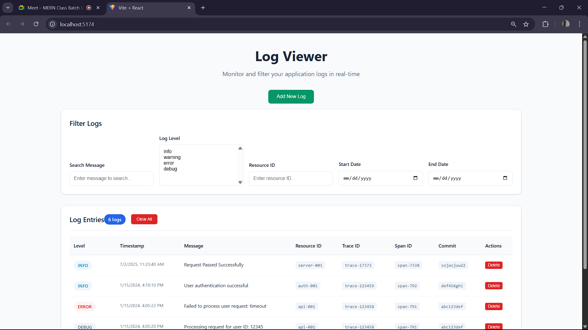

# 📊 Log Viewer & Management System

A modern, full-stack log management application built with React and Node.js. Monitor, filter, and manage your application logs in real-time with an intuitive web interface.


## ✨ Features

- **📝 Real-time Log Management**: Create, view, and delete logs with a modern web interface
- **🔍 Advanced Filtering**: Filter logs by level, message, resource ID, timestamp, and more
- **🎨 Modern UI/UX**: Clean, responsive design with intuitive user experience
- **⚡ Fast Performance**: Built with Vite for lightning-fast development and build times
- **🛡️ Data Validation**: Server-side validation using Joi schema validation
- **📱 Responsive Design**: Works seamlessly on desktop, tablet, and mobile devices
- **🗑️ Bulk Operations**: Clear all logs with a single click
- **🔧 RESTful API**: Clean API endpoints for log operations

## 🛠️ Tech Stack

### Frontend
- **React 19.1.0** - Modern UI library with hooks
- **Vite 7.0.0** - Fast build tool and development server
- **Axios** - HTTP client for API communication
- **CSS3** - Modern styling with CSS custom properties
- **ESLint** - Code quality and consistency

### Backend
- **Node.js** - JavaScript runtime
- **Express.js 5.1.0** - Web application framework
- **Joi 17.13.3** - Schema validation library
- **CORS** - Cross-origin resource sharing
- **File System** - JSON-based data persistence

## 🚀 Quick Start

### Prerequisites
- Node.js (v16 or higher)
- npm or yarn package manager

### Installation

1. **Clone the repository**
   ```bash
   git clone <repository-url>
   cd Task
   ```

2. **Install backend dependencies**
   ```bash
   npm install
   ```

3. **Generate sample data (optional)**
   ```bash
   node setup.js
   ```

4. **Install frontend dependencies**
   ```bash
   cd frontend
   npm install
   ```

5. **Start the backend server**
   ```bash
   # From the root directory
   node index.js
   ```
   The backend will start on `http://localhost:3001`

6. **Start the frontend development server**
   ```bash
   # From the frontend directory
   cd frontend
   npm run dev
   ```
   The frontend will start on `http://localhost:5173`

7. **Open your browser**
   Navigate to `http://localhost:5173` to access the application

## 📸 Screenshots

### Main Dashboard


### Log Creation Form


### Advanced Filtering


## 🔧 API Endpoints

### Log Management
- `POST /logs` - Create a new log entry
- `GET /logs` - Retrieve logs with optional filters
- `DELETE /logs/:id` - Delete a specific log by ID
- `DELETE /logs` - Clear all logs

### Query Parameters for GET /logs
- `level` - Filter by log level (info, warning, error, debug)
- `message` - Search in log messages
- `resourceId` - Filter by resource ID
- `traceId` - Filter by trace ID
- `spanId` - Filter by span ID
- `commit` - Filter by commit hash
- `timestamp_start` - Filter logs from this date
- `timestamp_end` - Filter logs until this date

## 📁 Project Structure

```
Task/
├── index.js                 # Backend server (Express.js)
├── logs.json               # Log data storage
├── create-logs.js          # Sample log generator
├── setup.js                # Quick setup script
├── package.json            # Backend dependencies
├── frontend/               # React frontend
│   ├── src/
│   │   ├── App.jsx         # Main application component
│   │   ├── LogList.jsx     # Log display component
│   │   ├── LogFilters.jsx  # Filter controls
│   │   ├── LogCreator.jsx  # Log creation form
│   │   ├── api.js          # API communication
│   │   └── utils.js        # Utility functions
│   ├── package.json        # Frontend dependencies
│   └── vite.config.js      # Vite configuration
└── README.md               # This file
```

## 🎯 Usage Examples

### Creating a Log
```javascript
const logData = {
  level: 'info',
  message: 'User login successful',
  resourceId: 'auth-service-001',
  traceId: 'trace-123456',
  spanId: 'span-789',
  commit: 'abc123def',
  timestamp: '2024-01-15T10:30:00.000Z'
};

fetch('http://localhost:3001/logs', {
  method: 'POST',
  headers: { 'Content-Type': 'application/json' },
  body: JSON.stringify(logData)
});
```

### Filtering Logs
```javascript
// Get all error logs from a specific date
fetch('http://localhost:3001/logs?level=error&timestamp_start=2024-01-15');
```

## 🚀 Development

### Available Scripts

**Backend:**
- `node index.js` - Start the development server

**Frontend:**
- `npm run dev` - Start development server with hot reload
- `npm run build` - Build for production
- `npm run preview` - Preview production build
- `npm run lint` - Run ESLint

### Environment Variables
The application uses default ports:
- Backend: `3001`
- Frontend: `5173`

## 📝 License

This project is licensed under the ISC License.

## 🆘 Support

If you encounter any issues or have questions:
1. Check the [Issues](../../issues) page
2. Create a new issue with detailed information
3. Include steps to reproduce the problem

---

**Built using React and Node.js**
